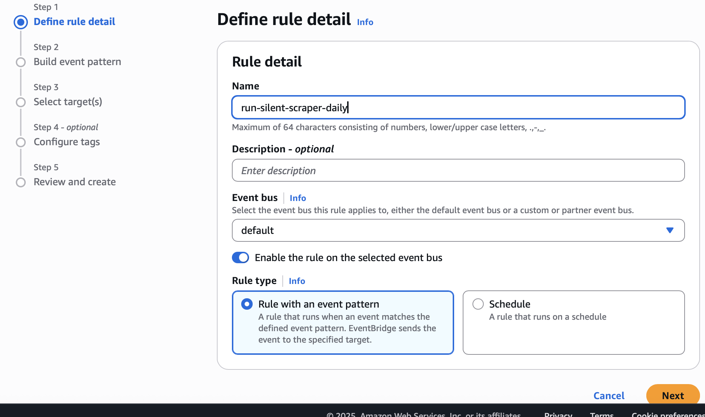

# 🧠 Silent Scalper: Automated Sneaker Price Tracker on AWS


---

## 📌 Project Overview

Silent Scalper is a fully automated sneaker price tracker built for the StockX marketplace. It scrapes sneaker listings daily, compares prices to user-defined targets, and sends email alerts using Amazon SES when deals are found.

This project is built for:

* Cloud engineers learning ECS, Fargate, and automation
* Sneaker enthusiasts who want alerts on drops
* Aspiring AWS DevOps or support engineers

---

## 📸 Architecture & Screenshots

### 🔁 System Architecture

* Dockerized Playwright scraper
* Lambda-compatible `price_tracker.py`
* Daily ECS Fargate Task via EventBridge
* SES email alerts
* DynamoDB for SKU targets

```
[EventBridge] --> [ECS Fargate Task] --> [Docker Container]
                                        |-> StockX Scraper
                                        |-> SES Email
                                        |-> DynamoDB Update
```

### ✅ ECS Task Success


### ⏰ EventBridge Rule



### 🐳 Docker Local Build Success


### 🚀 Manual Task Execution


### 🧪 Pytest CI/CD Confirmation


### 🌐 VPC / Subnet Setup


### ⚙️ Task Config


### 📩 SES Email 


### 📩 SES Email Alerts Recieved


### 🔍 CloudWatch Logs


### 🐳 Docker ECR Build Success


---

## ✨ Features

* 🔄 Scheduled sneaker scraping via ECS Fargate
* 🕵️ Playwright automation for dynamic StockX pages
* 💸 Target price alerts via AWS SES
* 🧪 Tested with Pytest inside CI/CD
* 📦 Docker container runs locally and in AWS

---

## 🏗️ AWS Infrastructure Summary

* **DynamoDB**: Holds sneaker SKUs and target prices
* **SES**: Sends email alerts
* **ECS Fargate**: Executes container once per day
* **CloudWatch**: Logs from container task
* **EventBridge**: Triggers task daily
* **IAM**: Roles for ECS task with SES + DynamoDB + Logs permissions

---

## 🔁 CI/CD with GitHub Actions

```yaml
- Checkout Code
- Set up Python + Pytest
- Run Unit Tests
- Build Docker Image
- Tag & Push to ECR
```

```yaml
- name: Build Docker image
  run: |
    docker build -t ${{ secrets.ECR_REPOSITORY }} .
    docker tag ${{ secrets.ECR_REPOSITORY }}:latest \
      ${{ secrets.AWS_ACCOUNT_ID }}.dkr.ecr.${{ secrets.AWS_REGION }}.amazonaws.com/${{ secrets.ECR_REPOSITORY }}:latest
```

---

## ⏲️ Running on ECS Fargate (Scheduled Daily)

* **Trigger:** EventBridge rule runs once daily
* **Container:** Pulls image from ECR
* **Network:** Attached to public subnet in VPC
* **Logs:** Sent to CloudWatch

> ✅ Verified by running manually and by scheduler

---

## 🧪 Testing

```bash
pytest tests/
```

Includes test cases for:

* Email alerts
* Lambda handler
* StockX scraping logic

---

## 🧠 Troubleshooting Journey

Here’s what I ran into and how I fixed it:

### 🔍 Playwright issues

* ❌ `BrowserType.launch` error
* ✅ Solved using Playwright Docker base image + `playwright install`

### 🧪 Pytest failures

* ❌ Missing browser in GitHub runner
* ✅ Fixed by installing dependencies in Dockerfile

### 🐳 Docker push errors

* ❌ Proxy network errors + image too large
* ✅ Used minimal image & GitHub CI/CD to push

### 📤 No manual ECR upload

* ❌ `Start image import` no longer available
* ✅ Built ECR repo and pushed via workflow

### 🔐 IAM Role Confusion

* ❌ Task had no permissions to SES/Dynamo
* ✅ Manually created IAM role with least-privilege access

---

## 🧰 Tech Stack

* **Python 3.11**
* **Playwright**
* **BeautifulSoup**
* **AWS ECS + Fargate**
* **AWS SES, DynamoDB, CloudWatch, EventBridge**
* **GitHub Actions + Docker Buildx**

---

## 🚀 Run Locally

```bash
# Build
docker build -t silent-scalper .

# Run locally
docker run --env AWS_ACCESS_KEY_ID=xxx --env AWS_SECRET_ACCESS_KEY=xxx silent-scalper
```

> You must have valid AWS credentials set via ENV or volume mount

---

## 🧾 License

MIT

---

## 🙌 Credits

Built by Maurice J. Colon as a showcase of AWS Cloud, CI/CD, and automation mastery.

---

## ✅ What's Next

* [ ] Add authentication to SES
* [ ] Add web UI to set sneaker targets
* [ ] Enable Twilio or SMS alerts
* [ ] Store historic price trends

---

Feel free to fork this, try it with your favorite kicks, or use it to learn how ECS + Docker + CI/CD work together! 👟
